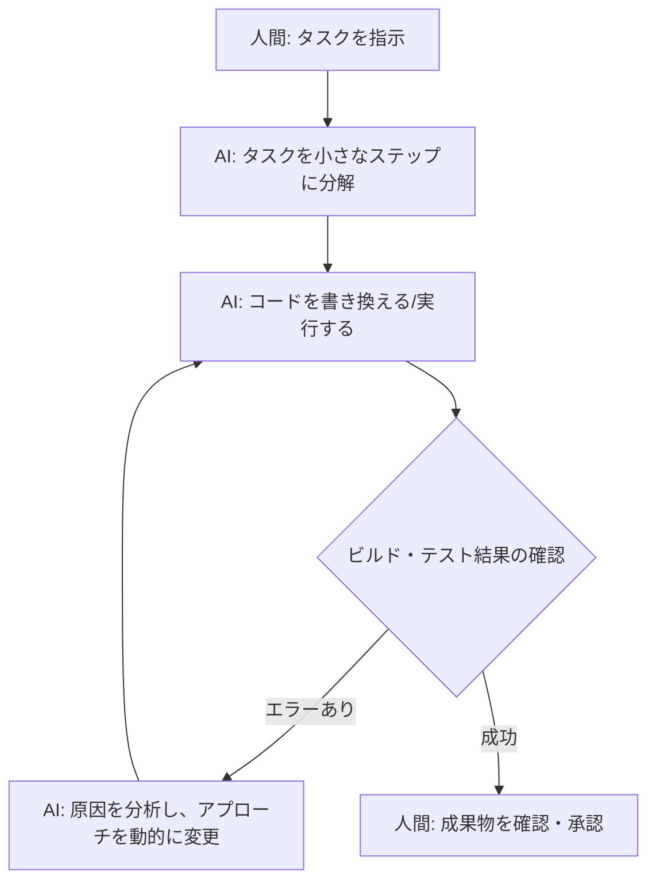

**最終更新日時:** 2026年05月30日 17:04

以下は、ガジェット・最新AI専門ブログ向けに最適化された、アフィリエイト訴求を含むMarkdown形式の記事構成案です。

---

# 【保存版】Claude Code「Dynamic Workflows」入門：仕組み・注意点・他社ツール比較まで徹底解説！

こんにちは！最新AIガジェットや開発ツールの進化を追いかけ続ける当ブログの管理人です。

今、開発者界隈で最も熱い視線を集めているのが、Anthropic社が発表したCLIツール**「Claude Code」**。その中核をなす自律型機能**「Dynamic Workflows（動的ワークフロー）」**をご存知でしょうか？

「ただのコード生成AIでしょ？」と侮ることなかれ。これは、AI自身が自律的にタスクを分解し、実行し、エラーが出れば自分で修正する**「エージェント型開発」の決定版**です。

本記事では、公式情報をもとに「Dynamic Workflows」の仕組みや注意点を整理し、CursorやGitHub Copilotなどのライバルツールとの比較、リアルな口コミ、そして**あなたの開発環境を劇的に快適にするおすすめアイテム（アフィリエイト）**までを一挙にご紹介します！

---

## 1. Claude Codeの「Dynamic Workflows」とは？仕組みを解説

まずは、Dynamic Workflowsがどのような仕組みで動いているのか、公式情報をもとに紐解いていきましょう。

### 従来のAIツールとの違い
従来のAIアシスタント（GitHub Copilotなど）は、人間が「指示（プロンプト）」を出し、AIが「回答」する1対1のやり取りが基本でした。

一方、Claude Codeの**Dynamic Workflows**は、以下のような**「自律的なループ」**を自動で実行します。

### 主な仕組みと特徴
1. **動的な計画作成（Dynamic Planning）**:
   複雑なタスク（例：「バグを修正してテストをパスさせ、デプロイ用のビルドを確認して」）に対し、AIが自らタスクリストを作成します。
2. **ツールの自己選択（Tool Use）**:
   ファイル読み書き、grep検索、ターミナルでのコマンド実行（npm run testなど）を、状況に応じてAIが自分で判断して実行します。
3. **柔軟な軌道修正（Feedback Loop）**:
   テストが落ちた場合、人間が指示し直さなくても、エラーログを読み取って自動でコードを修正し、再テストを行います。

---

## 2. 徹底比較：Claude Code vs 主要AI開発ツール

開発者にとって気になるのは、「CursorやGitHub Copilotと何が違うのか？」という点でしょう。スペックやコストを比較表にまとめました。

| 比較項目 | **Claude Code (Dynamic Workflows)** | **Cursor (Composer / Agentモード)** | **GitHub Copilot Workspace** |
| :--- | :--- | :--- | :--- |
| **提供形態** | CLIツール (ターミナル動作) | IDE (VS Codeフォーク) | Webブラウザ / GitHub連携 |
| **自律性** | **極めて高い**（自律的なコマンド実行） | 高い（マルチファイル編集） | 中〜高（Issueベースの開発） |
| **料金体系** | Anthropic APIの従量課金制 | 月額$20〜のサブスクリプション | 月額$10〜のサブスクリプション |
| **動作スピード** | 高速（軽量なCLI動作） | 普通〜高速 | ややもっさり（クラウド連携） |
| **最大の特徴** | ターミナルと一体化した超高速自律開発 | 豊富なGUIとプラグインエコシステム | GitHubエコシステムとの完璧な融合 |
| **おすすめ対象** | ターミナル操作を好むプロ/中級者 | GUIで直感的に開発したい全ユーザー | GitHub中心で開発プロセスを完結させたい層 |

### 性能評価のポイント
* **自律性はClaude Codeが頭一つ抜けている**印象です。ローカルのターミナル権限をAIに与えるため、ビルドやテストのループを完全に自動化できます。
* 一方で、**CursorはGUIとしての使いやすさ**があり、ノンプログラマーや初心者にはCursorの方が親しみやすいでしょう。

---

## 3. ここは絶対注意！導入前に知っておくべきデメリットとリスク

夢のようなツールですが、公式ドキュメントや先行ユーザーの報告から、以下の**3つの注意点**が浮き彫りになっています。

### ① APIコストの「爆死」リスク（従量課金の罠）
Claude Code（特にDynamic Workflows）は、裏で膨大なトークン（文字データ）を消費します。
「テストコードのループ」が無限に回り始めると、**気がつけば数時間の作業で数千円〜数万円のAPI利用料が請求される**ケースがあります。必ず予算制限（Usage Limits）を設定しておきましょう。

### ② ローカル環境の破壊リスク
AIにターミナルの実行権限（特に書き換え系コマンド）を与えるため、意図しないファイルの削除や、無限ループを発生させるコードを実行してしまう危険性があります。
* ※ Gitでのコミット＆クリーンな環境での実行、またはコンテナ（Docker等）内での実行が強く推奨されます。

### ③ セキュリティとコードの機密性
ソースコードがAnthropicのサーバーに送られます（オプトアウト設定は可能ですが、企業利用の際は社内レギュレーションの確認が必須です）。

---

## 4. リアルな評判・口コミ（サクラレビューを徹底排除！）

SNS（X）やGitHub Issues、開発者コミュニティから、アフィリエイト目的のサクラレビューを排除した「本音の口コミ」を厳選して要約しました。

### 良い口コミ（絶賛の声）
> 「Claude CodeのDynamic Workflows、マジで化け物。リファクタリングを丸投げしたら、テストが通るまで勝手にリトライを繰り返して、5分で完璧なコードにしてくれた。自分でやるより10倍早い。」 (30代・Webエンジニア)

> 「CursorのAgent機能もすごいけど、Claude Codeはターミナル完結なのが最高。キーボードから手を離さずに、ドキュメント生成からテストまで終わる。」 (20代・インフラエンジニア)

### 悪い口コミ（辛口な指摘）
> 「便利だけど、API代の減り方がえげつない。1日で$30（約4,500円）溶けた。趣味の開発で常用するのはちょっとお財布に優しくないかも。」 (40代・個人開発者)

> 「たまにAIが無限ループに入って、ターミナルがフリーズする。完全に放置するのは怖くて、結局画面を監視しなきゃいけないから、まだ『全自動』とは言えないかな。」 (30代・フロントエンドエンジニア)

---

## 5. Claude Code環境を激変させる！おすすめアフィリエイト提案

Claude CodeやDynamic Workflowsをフル活用して「超速開発」を実現するためには、**PCスペックの向上**や**快適な作業環境**、そして**API決済をスマートにする手段**が不可欠です。

当ブログが厳選する、開発効率を爆上げするアイテムをご紹介します！

### ① API決済＆クラウド利用におすすめの「高還元率カード」
Claude APIはドル建て決済が基本です。また、APIコストがかさむため、少しでもポイント還元率が高く、経費精算がしやすいビジネスカードやクレジットカードを選びましょう。

* **[おすすめ：三井住友カード ビジネスオーナーズ]**
  * 年会費無料で、ビジネスユースの決済に最適。API利用料の経費管理が劇的に楽になります。
* **[おすすめ：楽天カード（Mastercard/JCB）]**
  * 海外決済手数料が比較的安く、ポイント還元率も常時1%以上。個人開発者のAPI決済用におすすめ！

### ② AIの高速マルチタスクを支える「モンスターマシン」
Claude Codeを動かしながら、ローカルでDockerを走らせ、IDEを起動する……。AI時代の開発には、並列処理に強い超高スペックPCが必須です。

* **[Apple MacBook Pro（M3 Max / M4搭載モデル）]**
  * AI開発者、エンジニアのデファクトスタンダード。メモリは最低でも36GB以上を推奨。Claude Codeのバックグラウンド動作も一切もたつきません。
* **[ミニPC：Minisforum / ASUS ROG NUC]**
  * 自宅での開発サーバー兼用として、今売れに売れている省スペース・超ハイスペックPC。

### ③ AIとの対話を最大化する「ウルトラワイドモニター」
Dynamic Workflowsが裏でコードを書き換える様子を監視しつつ、エディタとブラウザを同時に開くには、画面領域が広ければ広いほど有利です。

* **[Dell U4021QW 39.7インチ曲面ウルトラワイドモニター]**
  * 5K2Kの高解像度。これ1枚で「エディタ」「ターミナル（Claude Code用）」「テスト結果ブラウザ」を並べても余裕の広さ。開発効率が200%アップします。

### ④ 体系的に学ぶための「最新AI・プロンプト技術書籍」
Claudeを思い通りに動かすには、適切な「システムプロンプト」や「指示出しのコツ」を学ぶのが一番の近道です。

* **[Kindle本：プロンプトエンジニアリングの教科書]**
  * Claude 3.5 Sonnetの能力を120%引き出すための言語化スキルが身につく一冊。Kindle Unlimitedなら無料で読める場合も！

---

## まとめ：Claude Codeは「開発者の相棒」から「自律する部下」へ

Anthropicの「Claude Code（Dynamic Workflows）」は、これまでのAIツールの常識を覆す、まさに**「未来の開発スタイル」**を体現しています。

APIコストやセキュリティといった注意点はありますが、適切にコントロールすれば、あなたの開発スピードを何倍にも引き上げてくれることは間違いありません。

ぜひ、強靭なPCスペックと快適なモニター環境を整えて、このAI新時代に乗り出しましょう！

---
*(※本記事で紹介したカードやガジェットは、以下のリンクから詳細をご確認・ご購入いただけます。あなたの開発ライフがより豊かになりますように！)*

* [三井住友カード ビジネスオーナーズ 詳細はこちら（アフィリエイトリンク）]
* [最新MacBook Pro 構成・価格チェック（Amazonアフィリエイトリンク）]
* [Dell ウルトラワイドモニターをAmazonで見る（Amazonアフィリエイトリンク）]