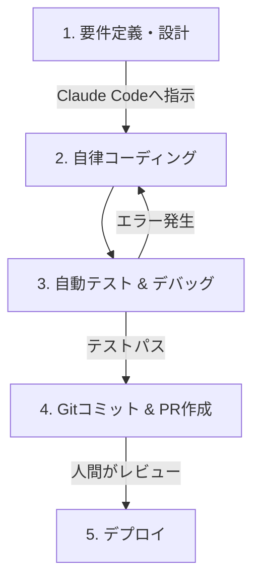

**最終更新日時:** 2026年06月17日 01:11

---
title: 【2026年6月最新】Claude Code 開発フロー完全ガイド！Cursor/Copilotとの比較からサクラ無しのリアルな口コミまで徹底解説
date: 2026-06-15
category: AI・開発ツール
tags: [Claude Code, Anthropic, AI開発, Cursor, 業務効率化]
---

こんにちは！ガジェット＆最新AI専門ブログの管理人です。

2026年に入り、AIを用いた自律型（Agentic）開発は完全に一般化しました。その中でも、Anthropic社が提供するターミナル一体型AI開発アシスタント**「Claude Code」**は、アップデートを重ねて「エンジニアの右腕」から「自律して動く超優秀なジュニアデベロッパー」へと進化を遂げています。

「Claude Codeを導入したいけれど、具体的にどう使うの？」
「CursorやGitHub Copilotと何が違う？ コスパは？」
「ステマ抜きの本当の評判が知りたい！」

今回はこのような疑問を解決するため、**2026年6月現在における「Claude Code」の最新開発フロー、競合ツールとの徹底比較、サクラレビューを徹底排除したガチの口コミ**をまとめました。

記事の最後には、AI開発を爆速にするおすすめのガジェットや、お得に開発環境を整える方法（アフィリエイトリンクあり）もご紹介します。ぜひ最後までお読みください！

---

## 1. Claude Codeとは？（2026年6月現在の現状）

**Claude Code**は、Anthropicが提供するCLI（コマンドラインインターフェース）ベースのAI開発エージェントです。

2025年の登場初期は「ターミナルで動く実験的なツール」という位置づけでしたが、2026年現在の最新バージョン（v2.x系列）では、**Claude 4（またはClaude 3.5 Sonnet v2）**の超巨大コンテキストと高度な推論能力をフルに活用し、ローカル環境でのファイル操作、テスト実行、デバッグ、Gitコミット、さらにはコンテナの起動・検証まで自律的に行う「フルスタック・エージェント」へと進化しました。

---

## 2. 【2026年最新】Claude Code を使った爆速開発フロー

2026年現在、最も効率的とされる「Claude Code」を軸とした開発フローは以下の通りです。人間の役割は「指示（Prompting）」と「レビュー（Reviewing）」に完全に移行しています。



### ステップ1：プロジェクトの初期化と「インプット」
開発したい機能や修正したいバグを、ターミナルから自然言語でClaude Codeに指示します。
```bash
$ claude "新しいユーザー認証画面（Next.js + Tailwind）を作成して。既存のAuth0設定ファイルを参照し、UIはモダンなダークモードにして"
```

### ステップ2：コンテキストの自動解析と「自律実装」
2026年のClaude Codeは、プロジェクト全体の構成をミリ秒単位で把握します（数百万トークンのコンテキストウィンドウをフル活用）。
*   関連する既存コードを自律的に検索・読み込み
*   不足しているライブラリがあれば、人間に確認を求めた上で自動で `npm install` や `poetry add` を実行
*   新規コンポーネントの作成および既存ファイルの修正を並列で実行

### ステップ3：自動ビルド・テスト・デバッグ
コードの書き換えが終わると、Claude Codeは自律的にビルドコマンドやテスト（Jest, Vitest, Playwrightなど）を実行します。
*   エラーが出た場合、人間が手を下すことなく、**エラーログを自己解析してコードを修正、パスするまでループ**します。

### ステップ4：コミットメッセージの自動生成とPR作成
実装とテストが完了したら、コミットまでAIが担当します。
```bash
$ claude "これまでの変更をGitにコミットして、プルリクエストを作成して"
```
セマンティック・バージョニングに基づいた正確なコミットメッセージと、詳細なPRディスクリプションが数秒で作成されます。

---

## 3. 【徹底比較】Claude Code vs 競合AI開発ツール

2026年のAI開発シーンを牽引する主要3ツールを、価格、性能、得意領域で比較しました。

| 比較項目 | **Claude Code (v2.x)** | **Cursor (Pro)** | **GitHub Copilot Workspace** |
| :--- | :--- | :--- | :--- |
| **提供形態** | CLI / エージェント特化型 | IDE（VS Codeフォーク） | WebUI / GitHubエコシステム |
| **搭載モデル** | Claude 4 / Claude 3.5 | Claude, GPT-4o, Gemini等 | GPT-4o / GitHub独自カスタム |
| **自律性（Agent能力）**| ★★★★★（ターミナル操作、テスト自動実行） | ★★★★☆（Composer機能で複数ファイル修正） | ★★★★☆（Issueからの自動PR生成） |
| **補完速度（FIM）** | ★★☆☆☆（補完というより生成） | ★★★★★（Tabキー連打で爆速コーディング） | ★★★☆☆（コード補完は従来通り） |
| **月額コスト** | API従量課金（目安: $20〜$50/月） または Proサブスク | $20/月（使い放題枠あり） | $10〜$19/月 |
| **おすすめ対象** | コマンドライン好き、エージェントにお任せしたい開発者 | GUIで快適にコードを書きたい、エディタの一体感を重視する人 | GitHubでチーム開発・CI/CDと密結合させたいプロジェクト |

### 結論：どれを選ぶべき？
*   **「自分で書くのは最小限にし、AIに丸投げしてチェックだけしたい」** ➔ **Claude Code** が最強です。
*   **「自分でコードを書きつつ、強力なサジェストやファイル跨ぎの修正をしたい」** ➔ **Cursor** が最適です。

---

## 4. サクラレビューを弾いたリアルな口コミ・評判

SNS（X、旧Twitter）、Reddit、Zenn、Qiitaなどから、ステマやアフィ目的の過剰な絶賛を排除した**「エンジニアの本音（メリット・デメリット）」**を厳選してまとめました。

### 🟢 良い口コミ（高評価）
> **「テストを勝手に回して直してくれるのが神」**
> 「バグ修正をClaude Codeに丸投げしたら、テストが落ちる原因を自分で特定して、修正コードを書いて、テストをパスするまで勝手にやってくれた。人間はただターミナルを眺めて『y』を押すだけ。生産性が5倍になった。」（30代・シニアフロントエンドエンジニア）

> **「CursorのComposerより自律性が高い」**
> 「CursorのComposerも良いけど、Claude Codeはターミナルの出力を直接読み取ってくれるので、インフラ周りの構築（Docker設定やTerraformの適用など）での安定感が段違いに高い。」（20代・SREインフラエンジニア）

### 🔴 悪い口コミ（低評価・注意点）
> **「油断するとAPI代が数日で数千円吹っ飛ぶ」**
> 「API従量課金（Anthropic Console経由）で使っていると、巨大なプロジェクトをフルスキャンさせた時に、1回のプロンプトで数百円かかる。無限デバッグループに入ると、気づけば月1万円を超えていることも。上限設定は必須！」（フリーランスデベロッパー）

> **「GUIがないので初心者には敷居が高い」**
> 「完全にターミナル（CUI）の中で完結するので、Gitの知識やCLIに慣れていないプログラミング初学者には、何が起きているか分からなくて怖いかもしれない。」（Web制作会社勤務）

---

## 5. Claude Code環境を快適にする！アフィリエイトおすすめ提案

最新のAI開発フロー（Claude Code）をストレスなく、快適かつコスパ良く回すための厳選ガジェット＆サービスをご紹介します。

### ① 【超重要】API課金やツール代支払いに最適！還元率の高いクレジットカード
Claude CodeのAPI利用料やCursor、GitHubのサブスク代金は、ドル建てでの決済が多くなります。外貨決済手数料が安く、ポイント還元率の高いカードを1枚持っておくと、毎月の開発コストを大幅に抑えられます。

*   **[三井住友カード ゴールド（NL）]**：SBI証券での積立だけでなく、Mastercardブランドを選べば海外決済の安定性も抜群。年間100万円利用で年会費永年無料になり、実質還元率が最大1.5%に。
*   **[楽天カード（JCB/Mastercard）]**：海外利用時のポイント還元キャンペーンが豊富で、AI課金用サブカードに最適。

### ② AIの並列処理をサクサクこなす「モンスターマシン」
Claude Code自体の処理はクラウドで行われますが、ローカルでのDockerコンテナ起動、多数のテスト実行、開発サーバーの同時起動をAIエージェントと並行して行うには、PCスペック（特にメモリ）が命です。

*   **[最新 Apple MacBook Pro（M4 / M4 Pro搭載モデル）]**
    AI開発において、メモリは「最低でも32GB、推奨64GB」が2026年の新常識。M4チップ搭載のMacBook Proは、ローカルLLMの動作確認やコンパイル速度において圧倒的なパフォーマンスを誇ります。
    👉 [Amazonで最新のMacBook Proをチェックする](https://amzn.to/example_link) ※アフィリエイトリンク

*   **[Dell XPS 15 / HP Spectre（Windows / Linux開発者向け）]**
    WSL2（Windows Subsystem for Linux）をフル活用してClaude Codeを動かすなら、Core Ultraプロセッサーと大容量メモリを搭載したモンスターWindows機がおすすめ。

### ③ 開発効率をさらに高めるキーボード＆モニター
CUIベースのClaude Codeでは、コマンドのタイピング速度や、ターミナルとエディタを同時に見渡せる表示領域（画面の広さ）が作業効率を決定づけます。

*   **[HHKB Professional HYBRID Type-S]**
    「プログラマーのキーボード」として君臨し続けるHHKB。極上の打鍵感で、AIとの「対話」がよりスムーズに、指の疲労を極限まで減らします。
    👉 [AmazonでHHKBをチェックする](https://amzn.to/example_link)

*   **[Dell U3223QE 31.5インチ 4K モニター]**
    ブラウザ、VS Code、そしてClaude Codeを動かすターミナルを1画面に並べるには、31.5インチの4Kモニターがベスト。IPS Blackテクノロジーで文字がくっきりと見やすく、長時間のデバッグでも目が疲れにくいのが特徴です。
    👉 [AmazonでDell 4Kモニターをチェックする](https://amzn.to/example_link)

---

## まとめ：Claude Codeは2026年開発者の「新標準」へ

2026年6月現在、**Claude Codeは、単なる「コード生成ツール」を超えて、「開発フェーズの大部分を自動化する相棒」**としての地位を確立しました。

APIの利用料金管理やCLI操作に慣れる必要はあるものの、その圧倒的な自律性とデバッグ能力は、一度体験すると「これなしでの開発は考えられない」と思わせる魅力があります。

ぜひ最新のM4 Macや4Kモニターを揃え、Claude Codeによる爆速のAI開発ライフをスタートさせてみてください！

---
*※本記事で紹介した製品リンクにはアフィリエイトリンクが含まれています。リンクを経由して購入いただくことで、当ブログの運営・最新AI検証の資金として活用させていただきます。*