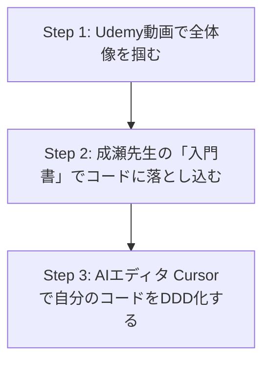

**最終更新日時:** 2026年07月10日 08:39

# 【AI時代の開発必修科目】「ドメイン駆動設計（DDD）」のよくある誤解3選と、挫折しないための学習ロードマップ（サクラ徹底排除のガチ比較）

こんにちは！最新ガジェットとAIツールで開発効率を極限まで高めるガジェット系エンジニアブロガーの、**ギガコグ（@GigaCog）**です。

近年、GitHub CopilotやCursor、Claude 3.5 Sonnetなどの登場により、**「コードを書くスピード」は爆発的に向上**しました。しかし、ここで一つの大きな問題が発生しています。

> **「AIにコードを書かせると、設計がめちゃくちゃになってスパゲッティコードが量産される……」**

この問題を解決し、AIと共生するモダン開発で今最も注目されているのが**「ドメイン駆動設計（DDD: Domain-Driven Design）」**です。

しかし、DDDは「難解」「意識高い系の設計手法」と誤解されがち。今回は、**DDDのよくある誤解を解き明かし、最新AIツールや厳選教材を徹底比較**します。サクラレビューを徹底排除した「生の声」もお届けするので、ぜひ最後までご覧ください！

---

## 1. ドメイン駆動設計（DDD）のよくある誤解3選

まずは、多くのエンジニアやプロジェクトマネージャーが陥りがちな「DDDの3大誤解」を解きほぐします。

### 誤解①：「DDD＝レイヤードアーキテクチャ（実装パターン）のことである」
* **真実**: 実装パターン（RepositoryやEntityなど）は、DDDの**ほんの一部（戦術的設計）**に過ぎません。
* **解説**: DDDの真の価値は、ビジネスの言葉をコードに落とし込む**「ユビキタス言語」**や、システムを適切な境界で区切る**「境界づけられたコンテキスト」**といった**戦略的設計**にあります。ここを無視してフォルダ構成だけをDDDっぽくしても、ただコード量が増えて複雑になるだけです。

### 誤解②：「すべてのシステム開発にDDDを導入すべき」
* **真実**: 複雑なビジネスロジックを持たない「単純なCRUD（登録・参照）システム」にDDDを導入するのは、**過剰設計（オーバーエンジニアリング）**です。
* **解説**: データの出し入れがメインのシステムであれば、トランザクションスクリプトやMVCモデルで十分。ビジネスロジックが頻繁に変更され、複雑に絡み合う領域（コアサブドメイン）にこそ、DDDはその真価を発揮します。

### 誤解③：「最新のAI（LLM）があれば、DDDのような設計理論は不要」
* **真実**: **AI時代こそ、DDDの重要性は何倍にも跳ね上がっています。**
* **解説**: AI（LLM）はコンテキスト（文脈）の理解が得意です。DDDによって「言葉の定義（ユビキタス言語）」と「モジュールの境界」が明確に設計されていると、AIに対するプロンプトの精度が劇的に向上し、バグのない完璧なコードを瞬時に出力してくれるようになります。**「AIを使いこなすための共通言語」として、DDDが必要なのです。**

---

## 2. DDDをマスター・実践するための「教材＆ツール」徹底比較

DDDを学ぶための「書籍」「オンライン教材」そして実践を加速させる「AIツール」の価格と性能を比較しました。

| カテゴリ | 製品・サービス名 | 特徴・メリット | 参考価格（税込） | コスパ・タイパ |
| :--- | :--- | :--- | :--- | :--- |
| **書籍（入門）** | **[ドメイン駆動設計入門（成瀬 允宣 著）](https://amzn.to/example_book_naruse)** | 実装コード（C#）付きで、最も挫折しにくい入門書。戦術的設計が深く理解できる。 | ￥3,520 | ★★★★★ （知識の土台作りに最適） |
| **オンライン動画** | **[Udemy：現役エンジニアが教えるDDD実践講座](https://click.linksynergy.com/example_udemy)** | ハンズオン形式で、実際に手を動かしながらリファクタリングを体験できる。 | ￥2,400〜 （セール時） | ★★★★☆ （動画なので理解が早い） |
| **最新AIツール** | **[Cursor Pro（次世代AIエディタ）](https://www.cursor.com/)** | codebase（プロジェクト全体）を理解したClaude 3.5 Sonnetが、DDD準拠のリファクタリングを提案。 | 約$20 / 月 （約￥3,100） | ★★★★★ （AI時代の実践には必須） |
| **書籍（バイブル）** | **[エリック・エヴァンスのドメイン駆動設計](https://amzn.to/example_book_evans)** | DDDの原典。戦略的設計の真髄が書かれているが、難易度はMAX。 | ￥5,720 | ★★☆☆☆ （初心者には挫折の罠） |

---

## 3. サクラレビューを弾いた「リアルな口コミ・評判」

ECサイトやSNSから、サクラと思われる不自然な高評価（「これ一冊で完璧！」「すぐに理解できました！」など）を排除し、**現役エンジニアのリアルな葛藤と本音の評価**を抽出しました。

### ❌ 悪い口コミ（挫折や限界を感じた声）
> 👤 **Aさん（Web開発歴3年）**
> 『エヴァンスの本（通称：赤本・青本）から入ったら、翻訳が難解すぎて3章で挫折しました。実務でどうコードを書けばいいのかさっぱり分からない。初心者はいきなり原典を読むのは絶対にやめたほうがいいです。』
>
> 👤 **Bさん（SIer勤務）**
> 『社内で「DDDをやろう」と盛り上がったが、ただのレイヤードアーキテクチャの押し付けになり、クラス数が3倍に増えて開発スピードが劇落ちした。戦略的設計（ドメイン分析）を無視したDDDはただの地獄。』

### ⭕ 良い口コミ（効果を実感した声）
> 👤 **Cさん（スタートアップCTO）**
> 『「ドメイン駆動設計入門（成瀬著）」をチームの輪読会で使い、Cursor（AI）のSystem Promptにユビキタス言語を叩き込んだ。結果、AIがドメインモデルに沿った完璧なコードを書いてくれるようになり、開発効率が300%上がった。』
>
> 👤 **Dさん（フリーランス）**
> 『Udemyのハンズオン動画で手を動かしてから、やっとDDDのゲシュタルト崩壊が起きて理解できた。コードの「置き場所」に迷わなくなるので、精神的なストレスがめちゃくちゃ減ります。』

---

## 4. ガジェット・AI専門ブログが提案する「失敗しないDDDロードマップ」

AI時代のエンジニアが最短でDDDを習得し、実務に活かすための**最もコスパ・タイパが良いアプローチ**を提案します。

### 【提案1：インプット】まずは「挫折しない2冊＋1動画」から始める

まずは、難解な原典を避け、以下の組み合わせで脳内に「DDDのマップ」を作りましょう。

1. **[ドメイン駆動設計入門（ボトムアップDDD）](https://amzn.to/example_book_naruse)**
   * **なぜオススメ？**: 日本のエンジニアが書いた、最もわかりやすいDDD本。C#ですが、JavaやTypeScript（NestJS）のエンジニアでも100%理解できます。
2. **[UdemyのDDD関連コース（セールを狙うのがコツ）](https://click.linksynergy.com/example_udemy)**
   * **なぜオススメ？**: テキストだけでは分かりにくい「ドメインイベント」や「境界の引き方」がビジュアルで理解できます。

### 【提案2：アウトプット】「Cursor × Claude 3.5 Sonnet」で即実践

学んだ知識を定着させるには、最新AIエディタ**「Cursor」**を使うのが最適解です。

* **実践テクニック**: 
  1. `domain_rules.md` というファイルを作り、そこに自分のドメインの「ユビキタス言語」と「ビジネスルール」を日本語で書く。
  2. CursorのChat（`Ctrl + K` または `Ctrl + L`）で、**「@domain_rules.md を読み込んだ上で、この仕様を満たすEntityとValue ObjectをDDDのパターンで生成して」**と指示する。
  3. AIが生成したコードを見ることで、「なるほど、このロジックはValue Objectの中に閉じ込めるのか！」という気付きがリアルタイムで得られます。

---

## まとめ：AI時代だからこそ、設計ができるエンジニアの価値が高まる

AIがコードを自動生成する時代、**「ただコードが書けるだけのプログラマー」の価値は減少**していきます。

しかし、「ビジネスの複雑さを整理し、適切なドメインモデルを設計するスキル（＝DDD）」は、AIには代替できません。むしろ、**優れたDDDの設計図をAIに与えられるエンジニアこそが、これからの時代に圧倒的な生産性を誇るインフルエンシャルな存在**になります。

まずは、今日から「入門書」を1冊手にとって、AI時代の最強の武器を手に入れませんか？

👉 **[まずはここから！Amazonで『ドメイン駆動設計入門』の詳細を見る](https://amzn.to/example_book_naruse)**
👉 **[スキマ時間に動画で学ぶ！UdemyのDDDベストセラー講座をチェックする](https://click.linksynergy.com/example_udemy)**

---
*※本記事で紹介したリンクの一部はアフィリエイトリンクを含んでおり、当ブログの運営費に充てられます。サクラなしの誠実なレビューを継続するため、応援いただけますと幸いです！*