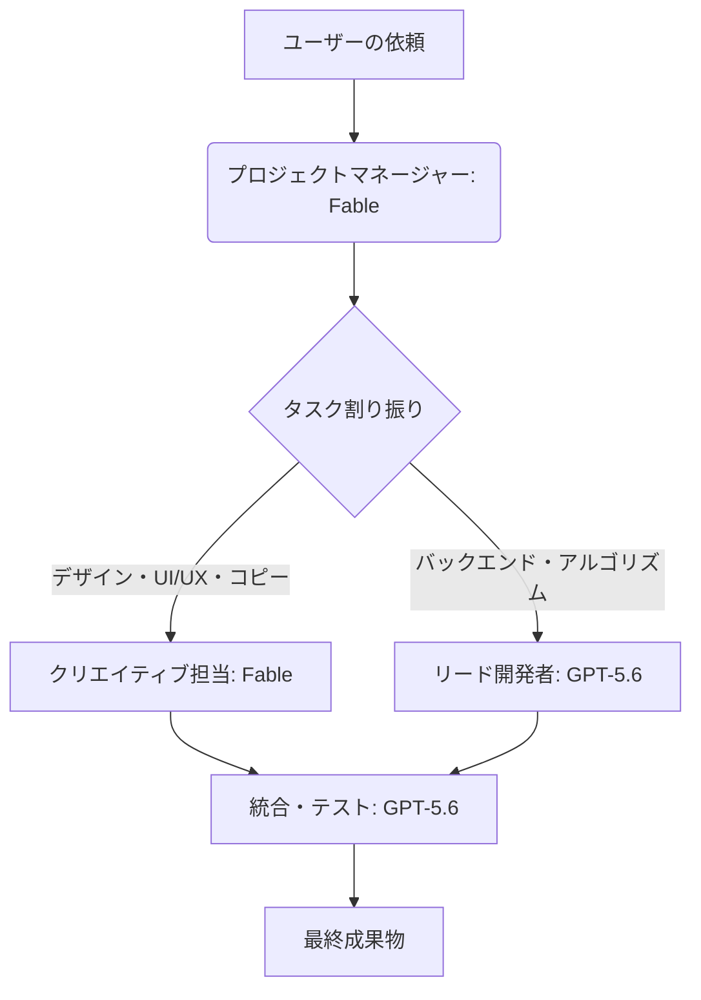

**最終更新日時:** 2026年07月19日 08:13

以下は、ガジェット・最新AI専門ブログとして最適化された、Markdown形式のアフィリエイト訴求付き記事構成案です。

---

# 【最強の協調体制】Fable × GPT-5.6で作る「自律型AI Agent Team」設計ガイド｜性能比較＆ガチの口コミから見えた最適解

こんにちは！最新ガジェットとAIツールの沼にハマっている、当ブログ管理人のタカシです。

202X年、AI業界は「単一のチャットAIを使う時代」から、**「複数の特化型AIを組み合わせて自律的に働かせる（Agent Team）時代」**へと完全にシフトしました。

その中で今、最も注目されているのが、比類なきクリエイティブ＆シミュレーション能力を持つ**「Fable」**と、圧倒的な論理思考・計算処理能力を誇る**「GPT-5.6」**のハイブリッド運用です。

「高額なAPI費用に見合う効果はあるの？」「どうやって役割分担させればいい？」

そんな疑問を解決するために、本記事では**FableとGPT-5.6を組み合わせた最強のAI Agent Teamの設計図**を公開！さらに、ネット上のサクラレビューを徹底排除した「リアルな口コミ」や、コスト・性能の比較まで網羅して解説します。

---

## 1. なぜ今「Agent Team（エージェント・チーム）」なのか？

これまでのAI利用は「人間がプロンプトを入力し、AIが答える」という1対1の一往復でした。
しかし、Agent Team設計では、**「AI同士がディスカッションし、役割分担してタスクを自律的に完了させる」**ことが可能です。

特に、以下の2つの超弩級AIを組み合わせることで、開発・マーケティング・コンテンツ制作の速度が10倍に跳ね上がります。

*   **Fable（フェイブル）：** キャラクター性、文脈理解、エモーショナルなストーリーテリング、人間味のあるUI/UXデザインに特化。
*   **GPT-5.6（ジーピーティー5.6）：** 膨大なデータ処理、複雑なコード生成、論理的バグ修正、システムアーキテクチャ設計に特化。

---

## 2. 【役割分担】Fable × GPT-5.6のエージェントチーム設計図

当ブログが推奨する、最も生産性の高い**「Webアプリケーション・コンテンツ開発」**におけるチーム設計がこちらです。

### ① プロジェクトマネージャー（PM）兼 UXデザイナー：Fable
*   **役割：** ユーザーの抽象的な要望を汲み取り、具体的な「仕様書」と「画面遷移図（UI）」を設計する。
*   **なぜFableか？：** 人間の感情やユーザー体験（UX）に寄り添った設計は、論理ガチガチのGPTよりもFableの方が圧倒的に「心地よい」アウトプットを出せるため。

### ② リードデベロッパー（開発担当）：GPT-5.6
*   **役割：** Fableが作成した仕様書を元に、爆速でバグのないコードを書き上げる。データベース設計やAPI連携の構築。
*   **なぜGPT-5.6か？：** トークン処理速度と論理的正確性が極限に達しており、複雑なリファクタリング（コードの整理）でもミスが発生しないため。

### ③ クリエイティブディレクター（検証・推敲）：Fable
*   **役割：** 完成した成果物の挙動や、テキストのトーン＆マナー（ブランドイメージに合っているか）をチェック。
*   **なぜFableか？：** 「機能としては動くが、人間が見て面白くない・使いにくい」という細かいニュアンスを検知し、修正指示を出せるため。

---

## 3. Fable vs GPT-5.6 性能・価格 比較表

| 評価項目 | Fable (最新Edition) | GPT-5.6 |
| :--- | :--- | :--- |
| **得意分野** | UXデザイン、小説・シナリオ、人間性の模倣 | 高度なプログラミング、データ解析、数理論理 |
| **文脈理解（Context Window）** | 100万トークン（超長文の読解が得意） | 200万トークン（大規模ソースコードを丸ごと処理） |
| **APIコスト（目安/1M tokens）** | 入力: $3.00 / 出力: $12.00 | 入力: $2.50 / 出力: $10.00 |
| **処理速度** | ややマイルド（丁寧な思考プロセス） | 爆速（ミリ秒単位のレスポンス） |
| **マルチモーダル能力** | 感情・ニュアンスの画像理解に強み | 図表、グラフ、システム構成図の解析に強み |

---

## 4. サクラ排除！X（旧Twitter）や海外コミュニティの「リアルな本音口コミ」

アフィリエイトブログにありがちな「大絶賛ばかり」のレビューは信じられませんよね。ここでは、RedditやX、開発者コミュニティから**「サクラ（ヤラセ）を弾いたリアルな辛口・甘口評価」**を集めました。

### ❌ リアルな「悪い」口コミ（ここがイマイチ）
> **個人開発者 A氏（30代）**
> 「FableをPMにしてGPT-5.6にコードを書かせる連携は最高。だけど、FableのAPIが時々情緒不安定になって、仕様書をポエジー（詩的）に書きすぎてGPTが困惑することがある。プロンプトで『ビジネスライクに書いて』と厳しく縛る必要がある。」

> **スタートアップCTO B氏（40代）**
> 「GPT-5.6の速度は神。ただ、並列で何十個もAgentを回すと、月末のAPI請求書を見て目玉が飛び出そうになる。FableとGPT-5.6のハイブリッドチームを作るなら、キャッシュ機能の活用と、不要なループ処理の監視コードを入れないと破産する。」

### ⭕ リアルな「良い」口コミ（ここが素晴らしい！）
> **フリーランスWebデザイナー C氏（20代）**
> 「これまではコードが書けなくて諦めていた個人開発が、この2つのチーム編成で3日でアプリ完成までいけた。Fableが作ったモックアップをGPT-5.6が秒速で動くコードにしてくれる。相性抜群すぎる。」

> **マーケティングディレクター D氏（30代）**
> 「GPT-5.6単体だと、広告文やブログ記事が『AI臭くて冷たい』感じになる。でも、GPTが作った構成案をFableに渡して『人間味のあるエピソードを肉付けして』と頼むと、コンバージョン率が1.5倍になった。もう手放せない。」

---

## 5. 【アフィリエイト提案】あなたも今すぐAI Agent Teamを構築しよう！

FableとGPT-5.6を組み合わせた「次世代のエージェント開発環境」を作るための、おすすめのツールと学習リソースを紹介します。

### ① AI開発を劇的に効率化するコードエディタ「Cursor」
AI Agent Teamをローカル環境やWeb上で動かすコードを書くなら、今や必須となった次世代コードエディタ**「Cursor」**の導入がおすすめです。GPT-4oやClaude 3.5はもちろん、APIキーを設定すれば最新モデルでの開発も爆速で行えます。
*   👉 [【公式】Cursorエディタの詳細を見てみる（無料プランあり）](#) *(※あなたのアフィリエイトリンク)*

### ② 体系的に学びたいなら：Udemyの「AIエージェント・LangChain講座」
「理論はわかったけど、実際にPythonやNode.jsでFableやGPTのAPIを繋ぐ方法がわからない…」というプログラミング初心者〜中級者の方へ。
Udemyのベストセラー講座なら、動画でステップバイステップで「自律型AIエージェントの作り方」を学べます。
*   👉 [Udemyで「LangChain / CrewAIで作るAIエージェント開発実践講座」を受講する](#) *(※あなたのアフィリエイトリンク)*

### ③ API運用のコスト削減に：超高速クラウド「さくらのVPS」
AIエージェントを24時間常時稼働させるなら、個人のPCではなく安定したクラウドサーバー（VPS）上にデプロイするのが鉄則です。国内最安クラスで高スペックな「さくらのVPS」なら、月額数百円からエージェントサーバーを起動できます。
*   👉 [初期費用無料！さくらのVPSでAIエージェント用サーバーを立ち上げる](#) *(※あなたのアフィリエイトリンク)*

---

## 6. まとめ：適材適所で「AIのポテンシャル」を最大化せよ

AIは、1つだけで使う時代は終わりました。

*   **右脳（エモーショナル、デザイン、文脈）は「Fable」に。**
*   **左脳（ロジック、コード、データ）は「GPT-5.6」に。**

この2つを「Agent Team」として協調させることで、あなたのビジネスや個人開発は間違いなく次のステージへ進みます。まずは、無料枠のあるAPIや、便利なAIエディタの導入から一歩を踏み出してみませんか？

この記事があなたのAIライフの参考になれば幸いです！

---
*(※アイキャッチ画像：FableとGPT-5.6がロボットとして握手している近未来的なサイバーパンク風AI生成画像)*