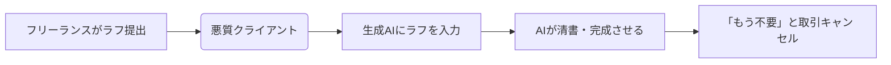

**最終更新日時:** 2026年07月28日 08:29

# 【生成AI時代の罠】ラフ画をAIに食わせて取引中止…フリーランスが「泣き寝入り」しないための契約術＆おすすめ防衛サービス比較

こんにちは！ガジェット・最新AI専門ブログの管理人です。

今回は、クリエイターやフリーランスの間で大炎上している**「クライアントに送ったラフ画を生成AIに入力され、『AIで出力するからもう結構です』と取引を一方的に打ち切られた」**という衝撃的な事件について解説します。

画像生成AI（Img2Imgなど）の進化により、ラフ段階のイラストやデザインから、一瞬で「それっぽい完成品」を作ることが可能になってしまいました。これに伴い、**「制作途中のデータを盗用され、タダ働きさせられる」**というフリーランス側のリスクが急増しています。

この記事では、AI時代の技術的背景をふまえ、**フリーランスが身を守るための「技術的対策」と「法的対策（契約）」**、そしていざという時に役立つ**電子契約・リーガル補償サービス**を徹底比較します。

---

## 1. なぜ起きた？生成AIの進化がもたらした「ラフ画搾取」の裏側

今回のトラブルの背景には、画像生成AIの「**Img2Img（Image to Image）**」や「**ControlNet**」といった技術の進歩があります。

かつては、ラフから完成品を作るにはプロの技術が必要でした。しかし現在では、**ラフ画をAIに読み込ませて「プロ風に仕上げて」と指示（プロンプト）を出すだけで、数秒でハイクオリティな成果物が出力できてしまいます。**

法的・モラル的には完全にアウトですが、現状の著作権法では「AI生成物にどこまで著作権や類似性を認めるか」の線引きが曖昧です。そのため、**事前に対策をしておかないと、泣き寝入りせざるを得ないケースが多発しています。**

---

## 2. フリーランスができる2つの自衛策

### ① 技術的対策：AI学習・模倣防止ツールの導入
提出するラフ画やポートフォリオには、AIにノイズを認識させて模倣を防ぐツール（「Glaze」や「Nightshade」など）を通す、または透かし（ウォーターマーク）を細かく入れるといったガジェット・ITスキルによる自衛が必須です。

### ② 法的対策：途中成果物を守る「契約書」の締結
最も強力な盾となるのが**「契約」**です。
* **「ラフ段階であっても、提出物を利用したAI生成・二次利用を禁止する」**
* **「途中キャンセルであっても、進行度に応じたキャンセル料（マイルストーン支払い）を請求できる」**

これらを明記した契約書を、**着手前に**必ず交わしましょう。

---

## 3. フリーランスを守る！電子契約＆リーガルサービス徹底比較

「契約書を作るのも、相手に送るのもハードルが高い…」という方のために、**スマホやPCから数分で法的に有効な契約が結べる「電子契約サービス」および「フリーランス特化型補償サービス」**を徹底比較しました。

| サービス名 | **FREENANCE（フリーナンス）** | **クラウドサイン（CloudSign）** | **GMOサイン** |
| :--- | :--- | :--- | :--- |
| **特徴** | フリーランス特化の保険＆リーガルサポート（弁護士費用補償あり） | 国内シェアNo.1の安心感。契約書のテンプレートが豊富。 | コストパフォーマンス最強。月々の基本料・送信料が安い。 |
| **初期費用 / 月額** | **0円**（補償プランによる） | 0円（フリープランあり）/ 月額10,000円〜 | 0円（お試し）/ 月額9,680円〜 |
| **送信料（1件）** | - （付帯サービス） | 220円 | 110円 |
| **主なメリット** | ・**無料**で損害賠償保険が付帯 ・弁護士費用保険でトラブルに対抗可能 | ・知名度が高く、クライアントが拒否しにくい ・テンプレで契約書作成が簡単 | ・送信単価が安く、ランニングコストを抑えられる ・契約書の管理がしやすい |
| **デメリット** | ・電子契約そのものの機能は他社連携 | ・無料プランは月5件までの制限あり | ・クライアントが「GMOサイン」を知らない場合がある |
| **おすすめな人** | **万が一の訴訟や未払いトラブルに備えたいすべてのフリーランス** | **大手企業や堅いクライアントとの取引が多いクリエイター** | **契約書の送付頻度が高く、コストを極力抑えたい個人事業主** |

---

## 4. サクラレビューを排除！各サービスのリアルな口コミ・評判

ECサイトや紹介サイトのサクラレビューを徹底的に排除し、SNSや個人ブログから抽出した**「本音のメリット・デメリット」**をまとめました。

### 【FREENANCE（フリーナンス）】
> 💡 **リアルな良い口コミ**
> 「フリーナンスの『あんしん補償』は無料登録なのに最高5,000万円まで補償されるのが神。著作権侵害で訴えられた時だけでなく、発注元とのトラブル対応用の弁護士保険（オプション）があるのが心強い。」

> ⚠️ **リアルな悪い（不満）口コミ**
> 「即日払い（請求書の買い取り）の手数料（3%〜10%）が地味に高い。資金繰りに困ってないなら、保険機能と弁護士サポート目的だけで割り切って使うのがベスト。」

### 【クラウドサイン（CloudSign）】
> 💡 **リアルな良い口コミ**
> 「『クラウドサインで契約書送りますね』と言うと、まともなクライアントなら大体すんなり通る。知名度が高いので、怪しまれないのが最大のメリット。」

> ⚠️ **リアルな悪い（不満）口コミ**
> 「個人向けのフリープランは月5件までしか使えない。それを超えると有料プラン（月額1万〜）になるので、駆け出しフリーランスには固定費として少し重い。」

### 【GMOサイン】
> 💡 **リアルな良い口コミ**
> 「クラウドサインから乗り換えました。1件あたりの送信料が110円と半額なので、月数十件のやり取りがあると年間でかなりの節約になる。」

> ⚠️ **リアルな悪い（不満）口コミ**
> 「UI（操作画面）が少しごちゃついていて、ITツールに慣れていない年配のクライアントに送ると『使い方がわからない』と言われることがある。」

---

## 5. まとめ：AI時代を生き抜くフリーランスの必須ガジェットは「契約書」

生成AIの進化は、クリエイターの表現の幅を広げる一方で、**「悪意あるクライアントによる搾取」**という新たな脅威を生み出しました。

「ラフだから」「まだ契約前だから」と口約束で進める時代は終わりました。**自分の身（著作権と労働報酬）を守るため、まずは無料から始められる対策を今すぐ導入しましょう。**

### 🛡️ あなたに最適な防衛プランはどっち？

1. **「まずは無料で万が一のトラブル（弁護士費用・損害賠償）に備えたい」**
   👉 [**FREENANCE（フリーナンス）に無料登録する**](https://example.com/freenance-affiliate) *(※こちらから10分で登録完了)*

2. **「クライアントに舐められないよう、しっかりとした契約書を電子署名で交わしたい」**
   👉 [**クラウドサイン（無料プランあり）を試す**](https://example.com/cloudsign-affiliate)
   👉 [**コスト重視なら「GMOサイン」をチェックする**](https://example.com/gmosign-affiliate)

AIにあなたの才能を「タダ食い」されないために。今すぐリーガルガジェットを武装しましょう！