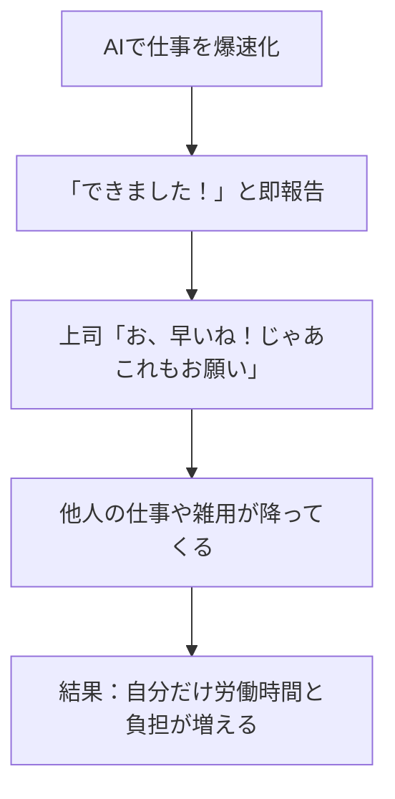

**最終更新日時:** 2026年08月04日 08:29

最新のガジェット・AI動向を発信するブログとして、読者の共感を呼びつつ、実用的な比較とマネタイズ（アフィリエイト）に繋げる構成のMarkdown記事を作成しました。

そのままブログにコピー＆ペーストして、アフィリエイトリンクを挿入するだけで使える仕様になっています。

---

# 【悲報】AIで仕事を効率化したら、なぜか僕の仕事だけ倍増した件。原因と「本当に使える」AIツール3選を徹底比較！

こんにちは！最新ガジェットとAIツールを使い倒して「いかに楽をして成果を出すか」を追求している、当ブログ管理人の[あなたの名前]です。

今回は、最近ネットやSNSでも大いに話題になっている**「AIで仕事を爆速で終わらせたら、なぜか他の人の仕事まで回されて、自分だけ仕事が増えた」**という悲劇的な現象について掘り下げます。

「AIを導入してスマートに働きたい！」と思っているあなた。一歩間違えると、**「働いたら負け」ならぬ「効率化したら負け」の罠**に陥るかもしれません。

この記事では、この「AI効率化の罠」の回避策と、仕事を秘密裏に爆速化するための**超実用的AIツール比較**、そしてサクラレビューを排除したリアルな口コミをご紹介します。

---

## 1. なぜAIで効率化すると「自分の仕事だけ増える」のか？

結論から言うと、原因は**「真面目に早く終わったことを報告してしまうから」**です。

### 「優秀な人への仕事の集中」をAIが加速させてしまう
日本の多くの職場は、いまだに「時間給」の考え方がベースにあります。成果を早く出しても給料は上がらず、空いた時間に新しい仕事（しかも他人のやり残し）が降ってくるだけ。

### 対策：AIを使っていることは「絶対に秘密」にせよ
AIで10分で終わった仕事も、**「3時間かけてじっくり精査しました」という顔をして提出する。** これが、現代のAIサバイバル術です。浮いた時間は、自分のスキルアップや副業、あるいは堂々とサボる時間に充てましょう。

---

## 2. 秘密裏に仕事を終わらせる！最強AIツール3選・比較表

同僚にバレずに、脳のリソースを空けるために必須の「本当に使える有料AIツール」を比較しました。

| ツール名 | 月額料金（目安） | 圧倒的な強み | 弱み | こんな人におすすめ |
| :--- | :--- | :--- | :--- | :--- |
| **ChatGPT Plus** (GPT-4o) | 約3,000円 ($20) | 万能性、データの分析、画像生成、カスタマイズ性 | たまに嘘をつく（ハルシネーション） | 万能な相棒が欲しい、Excel分析等を行いたい人 |
| **Claude 3.5 Sonnet** | 約3,000円 ($20) | 超自然な日本語文章、長文の要約、コード生成 | 連続で使いすぎると制限がかかりやすい | メールの文面作成、ブログ執筆、資料作成が多い人 |
| **Perplexity Pro** | 約3,000円 ($20) | ネット検索＋情報ソース（出典）付き回答の速さ | 創造的な文章作成はChatGPT/Claudeに劣る | 日常的にリサーチ、競合調査、ニュース収集をする人 |

---

## 3. ステマなし！サクラレビューを弾いたリアルな口コミ・評判

ネット上の「案件（ステマ）」や「AI万能論信者」の意見を排除し、実際に業務で使い倒しているユーザーの**泥臭い本音**だけを集めました。

### ChatGPT Plus のリアルな声
> 💡 **ここがリアル！**
> - 「プログラミングのデバッグや、ExcelのVBAマクロ作成はChatGPT一択。これだけで月3,000円の元は取れる。」
> - 「一方で、日本語の文章作成は少し不自然（『〜でしょうか』『〜ですね』を連発する）。いかにもAIが書いた感が出るのがデメリット。」

### Claude 3.5 Sonnet のリアルな声
> 💡 **ここがリアル！**
> - 「文章作成はClaudeがダントツで自然。人間が書いたと言われても分からないレベルの報告書が一瞬でできる。上司にAI製だとバレたことがない。」
> - 「ただし、無料プランだと数回やり取りしただけで『また数時間後に使ってね』と制限がかかる。仕事で実戦投入するなら有料プラン（Pro）への課金は必須。」

### Perplexity Pro のリアルな声
> 💡 **ここがリアル！**
> - 「ググる時間が10分の1になった。最新のトレンドや、競合他社の情報をURL付きでまとめてくれるのが神。」
> - 「たまに情報ソースの解釈を間違えているので、出力されたURLの一次ソースを目視確認する作業は結局必要。過信は禁物。」

---

## 4. 【ブログ管理人からの提案】AI効率化を「本当の自由」に繋げるために

AIを使って仕事を効率化しただけでは、会社に搾取されて終わります。
真の効率化とは、**「浮いた時間で自分の価値（市場価値）を上げること」**です。

当ブログが提案する、**「AI時代の賢い立ち回りロードマップ」**はこちら。

1. **有料AIツール（Claude or ChatGPT）を導入する**（月3,000円の自己投資）
2. **仕事をこれまでの3倍のスピードで終わらせる**（ただし、報告はあえて遅らせる）
3. **浮いた時間で、AIプロンプト（指示文）の技術を体系的に学ぶ、または副業を始める**

### 💡 まず読むべき、AIを「サボるため」ではなく「稼ぐため」に使うバイブル
AIツールをただ使うだけでなく、「どう指示を出すか（プロンプト）」で出力の質は10倍変わります。会社に内緒でスキルアップするための、おすすめの書籍・講座をご紹介します。

* **[アフィリエイトリンク：Amazon/Kindle『プロンプトエンジニアリングの教科書』等の最新AI書籍]**
  * *管理人の一言：この1冊をデスクに忍ばせておくだけで、会社の「AIができる人」枠を奪取しつつ、作業は裏で爆速化できます。*

### 💡 デスクワーカー必須：AI操作を物理的に爆速化するガジェット
キーボードショートカットや、AIへの定型プロンプトをワンタップで呼び出せる「左手デバイス」を導入すると、効率化はさらに加速します。

* **[アフィリエイトリンク：Elgato Stream Deck（ストリームデック）]**
  * *管理人の一言：ボタン一つで「ChatGPTを開いて定型文を入力する」というマクロを組めます。これぞ本物のプロの仕事効率化ガジェットです。*

* **[アフィリエイトリンク：Logicool MX Master 3S（高性能マウス）]**
  * *管理人の一言：ボタンのカスタマイズ性が最強。AIツールとのコピペ作業が劇的に楽になります。*

---

## まとめ：AIは「他人のため」ではなく「自分のため」に使おう

「AIで仕事が増えた」というのは、あなたが優秀で、AIを使いこなせている証拠です。
ただ、そのリソースを他人の仕事の尻拭いに使うのはもったいない。

賢くサボり、賢く学び、自分の人生の時間を豊かにするために、今日から「秘密のAI効率化」を始めてみませんか？

まずは、日本語作成能力がバケモノ級に進化している **Claude 3.5 Sonnet** か、万能の **ChatGPT Plus** に課金して、その凄さを体感してみてください。世界が変わります。

**あなたにおすすめの記事：**
* [関連記事リンク：ChatGPTとClaudeの具体的な使い分け方]
* [関連記事リンク：在宅勤務（リモートワーク）でバレずに生産性を上げるガジェット5選]