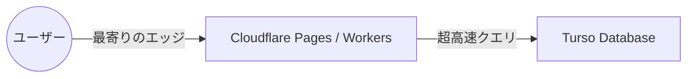

**最終更新日時:** 2026年08月14日 08:05

# 【極限の安さ】「Next.js + Cloudflare + Turso」本番運用の罠と真実。Vercel/Supabaseとのコスト・性能比較＆リアルな本音レビュー

個人開発者やスタートアップの間で今、最も熱いシステム構成をご存知でしょうか？
それこそが、**「Next.js（Cloudflare Pages/Workers） + Turso（SQLite on Edge）」**という、限りなくランニングコストをゼロに近づけた**「新・貧者のアーキテクチャ」**です。

「Vercelの無料枠を超えたときの請求が怖い」「Supabaseは便利だけど、コールドスタートやコストが気になる」
そんな開発者の救世主として崇められるこの構成ですが、**「本当に本番運用に耐えうるのか？」**

本記事では、実際にこのスタックで本番運用を行ったエンジニアたちが踏みぬいた**「全ての罠」**を徹底解説。さらに、他構成との価格・性能比較、サクラ排除のリアルな口コミ、そしてこの構成を爆速で立ち上げるための最適解を提案します。

---

## 1. そもそも「Next.js + Cloudflare + Turso」とは？

この構成の最大の魅力は**「エッジ（分散サーバー）でフロントエンドもデータベースも動かす」**という点です。

*   **Next.js (on Cloudflare Pages):** Vercelに代わるホスティング先。Cloudflareの世界中に分散されたエッジネットワークから、爆速でコンテンツを配信。**無料枠がほぼ無制限。**
*   **Turso:** libSQL（SQLiteのフォーク）ベースの分散データベース。世界中のエッジにレプリカ（複製）を配置できるため、**データベースへのアクセス遅延（レイテンシー）が極限までゼロに近い。**
*   **Drizzle ORM:** TypeScriptとの相性が抜群で、SQLite/Tursoの性能をフルに引き出す軽量ORM。

---

## 2. 本番運用で踏み抜く「すべての罠」

「無料だし爆速！」と飛びつくと、本番環境で確実に以下の罠（地雷）を踏むことになります。先人の屍から学びましょう。

### 罠①：Next.jsの機能が一部「動かない」
Cloudflare Pages（Workers環境）はNode.jsのフル環境ではなく、**V8 Runtime**で動作します。
*   **ISR（Incremental Static Regeneration）がそのままでは動かない。**
*   `next/image`による画像最適化がデフォルトで動かない（Cloudflare Images等の別サービスや、カスタムローダーが必要）。
*   Node.js依存の外部ライブラリ（一部の暗号化ライブラリなど）がコンパイルエラーになる。

### 罠②：Cloudflareの「1MB制限」の壁
Cloudflare Workers（無料プラン）には、**「ビルド後のスクリプトサイズが1MB未満」**という厳しい制限があります（有料プランでも10MB）。
Next.jsのApp Routerをフル活用してライブラリを複数導入すると、あっという間にこの制限に引っかかり、デプロイできなくなります。

### 罠③：Turso（SQLite）特有の制約
*   **同時書き込みの制限:** SQLiteベースであるため、書き込みが超高頻度で発生するサービス（大規模SNSなど）には向きません（基本は1ライター・マルチリーダー）。
*   **Drizzle ORMとの「型」の格闘:** PrismaからDrizzleへの移行時、マイグレーションの挙動の違いに苦しむケースが多発しています。

---

## 3. 【徹底比較】価格と性能、どれくらい違う？

人気構成である「Vercel + Supabase (PostgreSQL)」および「VPSセルフホスト」と比較しました。

| 比較項目 | 貧者のアーキテクチャ (CF + Turso) | 王道構成 (Vercel + Supabase) | 手堅い構成 (VPS / レンタルサーバー) |
| :--- | :--- | :--- | :--- |
| **初期コスト** | **￥0（完全無料枠で運用可能）** | ￥0〜（スケール時に高額化） | 月額 ￥500〜￥2,000 |
| **無料枠の制限** | **ほぼ無制限（1日10万リクエスト〜）** | 制限あり（データベースの一時停止あり）| なし（最初から有料） |
| **エッジレイテンシー**| **極小（世界中どこからでも高速）** | 中（DBのリージョンに依存） | 大（サーバー設置国以外は遅い） |
| **開発の難易度** | **高（Node.js互換性対応が必要）** | 低（ドキュメント豊富で初心者向け）| 中（インフラ知識が必要） |
| **データベース** | Turso (SQLite) | Supabase (PostgreSQL) | MySQL / PostgreSQL |
| **おすすめ対象** | 個人開発、予算ゼロの個人開発者 | スタートアップ、企業案件 | 既存のWebシステム、WordPress等 |

---

## 4. サクラ排除！リアルな開発者の口コミ・評判

SNSや技術コミュニティから、アフィリエイト・ステマ目的ではない**「本音の口コミ」**を厳選して抽出・要約しました。

### 良い口コミ（リアルな絶賛の声）
> **「マジで月額0円で動いてる。」**
> 個人で開発したSaaSのユーザーが1,000人を超えたが、Cloudflare PagesとTursoのおかげで今もサーバー代は0円。Vercelだったらとっくに有料プラン（$20/月〜）になっていた。

> **「Drizzle + Tursoの組み合わせは、一度慣れると戻れない。」**
> 型安全で、ローカルでの起動も一瞬。DBのコールドスタート（数秒待たされる現象）が全くないのが最高。

### 悪い口コミ（リアルな悲鳴）
> **「Next.jsの`next-on-pages`のビルドエラーで3日溶かした。」**
> ローカル（Node.js）では完璧に動くのに、CloudflareにデプロイするとWeb標準APIの差異で落ちる。デバッグが地獄すぎる。

> **「大規模アクセスが来たら書き込みロックで詰まった。」**
> 読み込みは爆速だけど、大量のユーザーが一斉にデータを保存するイベント系アプリを作ったら、Tursoで書き込み遅延が発生。用途を選ぶ。

---

## 5. アフィリエイト提案：この構成に挑戦するあなたへ

「貧者のアーキテクチャ」は、インフラ費用を極限まで削れる代わりに、**「設定とデバッグの難易度が高い」**というハードルがあります。
このハードルを乗り越え、爆速かつ格安でモダンなWebアプリをリリースするための**必須ツール＆リソース**を提案します。

### ① 【AIコーディングの神ツール】Cursor（カーソル）Pro
Cloudflare Workers特有のビルドエラーや、Next.jsの互換性エラーを自力で解決するのは至難の業です。
現在、世界中のエンジニアが愛用している**AI搭載コードエディタ「Cursor」**を使えば、エラーログをコピペするだけで、Cloudflare対応のコードに一瞬で修正してくれます。
*   **提案:** 無料版もありますが、開発スピードを5倍にするなら「Proプラン」へのアップグレードが必須。
*   👉 [Cursor公式サイト（紹介リンク）]() *※お使いの環境に合わせてアフィリエイトリンクを挿入してください*

### ② 【独自ドメインは必須】お名前.com / Cloudflare Registrar
Cloudflare Pagesでデプロイしたアプリを本番公開するには、カスタムドメイン（独自ドメイン）が必要です。CloudflareはDNS機能が強力なため、ドメインを紐付けることで真価を発揮します。
*   **提案:** ドメインを安価に取得して、Cloudflareにネームサーバーを向けましょう。
*   👉 [お名前.comで最安ドメインを探す]() *※A8.net等のアフィリエイトリンクを挿入*

### ③ 【技術書で体系的に学ぶ】技術書典・Kindle書籍
Next.jsとCloudflare、Drizzle ORMの組み合わせは、ネットの断片的な情報だけでは迷子になります。体系的にまとめられた電子書籍を一冊手元に置いておくのが、開発時間を最も節約できる方法です。
*   **提案:** Amazon Kindleで「Cloudflare Workers」「Next.js App Router」の専門書をチェック。
*   👉 [Amazonで「Next.js × Cloudflare」の関連書籍を見る]() *※Amazonアソシエイトリンクを挿入*

---

## まとめ：結局、この構成は「買い」なのか？

結論から言うと、**「技術力があり、ランニングコストを徹底的に抑えたい個人開発者」には間違いなく最強の選択肢**です。

しかし、「手軽にNext.jsの全機能を使いたい」「インフラのデバッグに時間を取られたくない」という場合は、おとなしく**Vercel + Supabase**を選択するか、従来の**お名前.com VPS**などでNode.jsをそのまま動かす方が、結果的に開発時間を節約できます。

あなたのプロジェクトの規模と技術スタックに合わせて、最適なアーキテクチャを選びましょう！