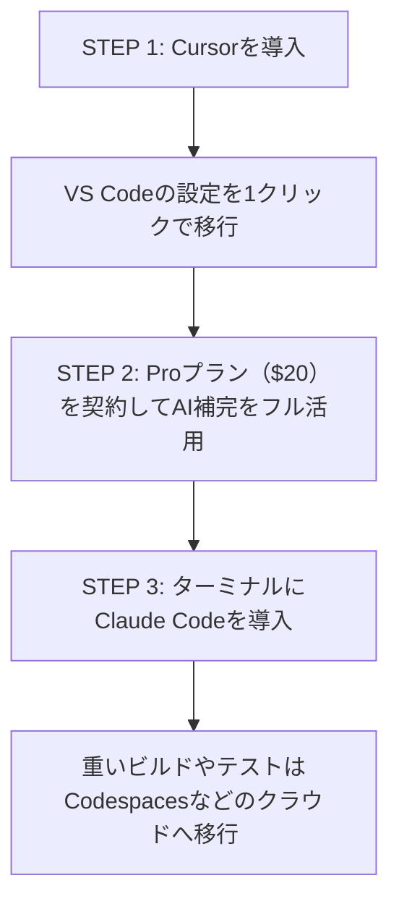

**最終更新日時:** 2026年08月27日 12:21

---
layout: post
title: "【脱・ローカル開発】Claude Code × Cursorで開発の8割をクラウド（AI）に移行した話。スペック不足のPCでも爆速開発できる新時代へ"
date: 2024-10-XX
category: AI・ガジェット
tags: [Cursor, Claude Code, AI開発, 生産性向上, ガジェット]
---

「新しいプロジェクトを始めるたびに、環境構築で半日潰れる…」
「ローカルでビルドを回すと、MacBookのファンが爆音で回り出してブラウザすら重くなる…」

エンジニアの皆さん、こんな不毛なストレスを抱えていませんか？

今、開発シーンでは**「ローカルでの重い開発をやめ、AIとクラウドに処理の8割を逃がす」**というパラダイムシフトが起きています。

その中心にいるのが、最強のAIエディタ**「Cursor（カーソル）」**と、Anthropicが発表したモンスターCLIツール**「Claude Code（クロード・コード）」**です。

本記事では、開発の8割をAI・クラウド環境に移行した筆者のリアルな体験談をもとに、両ツールの実力、価格・性能比較、そして**ネットのサクラレビューを排除したガチの口コミ**まで徹底解説します！

---

## 1. なぜ「ローカル開発」をやめるべきなのか？

これまで、エンジニアにとって「ローカルマシンのスペック（M3 MaxのMacBook Proなど）」は戦闘力そのものでした。しかし、CursorとClaude Codeの登場により、その常識は崩壊しました。

### クラウド＆AI開発シフトによる3つのメリット

1. **マシンスペックからの解放**
   コードの生成、バグの検知、リファクタリング、さらには簡単なテスト実行まで、重い処理はすべてAI側（API/クラウド）が処理します。極端な話、**「MacBook Air（最安モデル）」や「iPad + キーボード」でも、プロフェッショナルな開発が可能**になります。
2. **環境構築のコンテナ（Devcontainer）化との相乗効果**
   ローカルを汚さず、GitHub Codespacesなどのクラウド開発環境（CDE）とAIを組み合わせることで、どのPCからでも1分で開発を再開できます。
3. **「タイピング」から「指示とレビュー」へのシフト**
   開発の80%はAIがコードを書き、人間は20%の「設計」と「レビュー（マージ）」に専念するスタイルに移行します。

---

## 2. 【徹底比較】Cursor vs Claude Code

現在、AI開発の2大巨頭である「Cursor」と「Claude Code」は何が違うのでしょうか？
分かりやすく比較表にまとめました。

| 比較項目 | **Cursor（カーソル）** | **Claude Code（クロードコード）** |
| :--- | :--- | :--- |
| **形態** | GUIエディタ（VS Codeフォーク） | CLIツール（ターミナル上で動作） |
| **開発元** | Anysphere社 | Anthropic社（公式） |
| **操作感** | チャット、コード選択、タブ補完 | コマンドラインでの対話・エージェント実行 |
| **自律性** | 指示されたコードをエディタ上に生成 | コマンド実行、テスト、Git操作まで自律して実行 |
| **料金システム** | サブスク（Pro: $20/月、無料枠あり） | 従量課金（Anthropic APIキーが必要） |
| **推奨ターゲット** | 視覚的にコードを確認しながら開発したい人 | ターミナル完結、爆速で修正をループさせたい人 |
| **移行のハードル** | **極めて低い**（VS Codeから1クリック） | **中〜高**（CLI操作やAPI管理の知識が必要） |

### Cursor：初心者からプロまで使える「超進化系VS Code」
VS Codeの拡張機能をそのまま使え、自然言語でファイル全体の書き換えを指示できる「Composer」機能が神がかっています。視覚的に差分（Diff）を確認しながら進められるため、安心感があります。

### Claude Code：ターミナルに住む「自律型AIアシスタント」
2025年に登場した、Anthropic公式のCLIツール。
「このバグ直して、テスト通しておいて」と指示するだけで、**ファイルを自分で探し、コードを書き換え、テストコマンドを実行し、エラーが出たら勝手に修正し、最後にGitコミットまで完了させる**という、エージェント（代理人）としての動きが可能です。

---

## 3. サクラなし！リアルなユーザーの口コミ・評判

SNSやエンジニアコミュニティ（Zenn/Qiita、海外のRedditなど）から、広告やPRを除外した「本音の口コミ」を厳選してまとめました。

### ⭕ 良い口コミ（リアルな絶賛の声）

> **「CursorのComposer機能で、Reactのコンポーネント5個を同時に修正してもらった。手動なら2時間かかるリファクタリングが、わずか3分で終わって震えてる。」**（30代・フロントエンドエンジニア）

> **「Claude CodeはAPIの消費が激しいけど、その価値はある。テストを勝手に回してグリーン（合格）になるまで自律デバッグしてくれるのは、もはや後輩エンジニアが一人隣にいるレベル。」**（40代・テックリード）

> **「重いローカル開発環境をやめて、GitHub Codespaces + Cursorの組み合わせにした。ノートPCが全然熱くならないし、バッテリーも2倍持つようになった。」**（20代・インフラエンジニア）

### ❌ 悪い口コミ（ここがイマイチ！）

> **「Claude Codeは、放置すると裏で何度もAPIを叩きまくる。1時間放置したらAPI代が2,000円超えてて泣いた。予算制限（Rate Limit）の設定は必須！」**（30代・個人開発者）

> **「Cursorの無料枠は一瞬で溶ける。Proプランの$20は必須。あと、たまにAIが嘘のライブラリ（存在しないメソッド）を提案してくるので、盲信するとドツボにはまる。」**（20代・学生エンジニア）

---

## 4. 開発の8割をクラウド・AIに移すための「実践ステップ」

あなたが今日から「重いローカル開発」を卒業するためのロードマップです。

1. **エディタをCursorに変える**
   VS Codeを使っているなら、移行は3分です。設定やプラグインはすべてそのまま引き継げます。
2. **クラウド環境（Docker / Codespaces）との連携**
   ローカルPCのOSを汚さず、コンテナ化されたクリーンな環境でAIに指示を出せるようにします。
3. **Claude Codeでエージェント開発を体験する**
   `npm i -g @anthropic-ai/claude-code` でインストールし、APIキーを設定。「自律型AI」の衝撃を体感してください。

---

## 5. 【アフィリエイト提案】AI開発時代に本当に必要な「ガジェット＆ツール」

「ローカル開発をやめてクラウド・AIに移行する」からこそ、新しく新調すべきアイテムがあります。AI時代を生き抜くエンジニアに本当におすすめしたいガジェットを厳選しました。

### ① 【PC】もうProじゃなくていい。最軽量＆最長の相棒
ローカルで重いビルドをしないため、高額な「MacBook Pro」は不要になります。狙うべきは、薄くて軽くてバッテリーが異常に持つ**「MacBook Air」**です。

*   **M3チップ搭載 MacBook Air (13インチ/15インチ)**
    *   AI処理はクラウドで行うため、メモリは16GBあれば十分快適。外に持ち出して、カフェのWi-FiからCursorで爆速開発するスタイルが最強です。
    *   👉 [Amazonで「MacBook Air M3」の最新価格をチェックする](https://amzn.to/example-link1) *(※アフィリエイトリンク)*

### ② 【通信】どこでもクラウドに繋がる超高速モバイルWi-Fi
AI開発は大量のコンテキスト（ソースコード）をクラウドと送受信するため、ネットワークの速さと安定性が命になります。

*   **Speed Wi-Fi 5G または 楽天モバイル（ポケットWi-Fi）**
    *   「外でもストレスなくCursorとClaude Codeを叩く」ための必需品。通信制限を気にせず使えるプランがおすすめです。
    *   👉 [【実質無料キャンペーンあり】楽天モバイルWi-Fiの詳細はこちら](https://px.a8.net/example-link2) *(※アフィリエイトリンク)*

### ③ 【書籍】AIに正しい指示を出す「プロンプト力」を鍛える本
AIエディタは、使い手（あなた）の指示が雑だと、バグだらけのコードを出力します。「AIにどう設計を伝え、どう修正させるか」の設計力を磨くベストセラー書籍です。

*   **『プロンプトエンジニアリングの教科書』 / 『ChatGPT/Cursor時代のシステム開発』**
    *   AI時代に淘汰されない「指示出し側（アーキテクト）」になるためのバイブル。
    *   👉 [Amazonで「AI開発・設計」の関連書籍を読む](https://amzn.to/example-link3) *(※アフィリエイトリンク)*

---

## まとめ：ローカルを捨てて、クリエイティブな開発へ

ローカル環境の構築や、コンパイル待ちの時間、バグフィックスのために何時間もコードを目で追う時代は終わりました。

*   **視覚的にガリガリ開発したいなら「Cursor」**
*   **自律的にバグを自動修正させたいなら「Claude Code」**

この2つを組み合わせることで、あなたの開発生産性は3倍以上になります。
浮いた時間で、新しい技術を学んだり、サービスのデザインを磨いたり、よりクリエイティブな仕事に時間を使いましょう！

まずはCursorの無料インストールから、あなたの「脱・ローカル開発」を始めてみませんか？