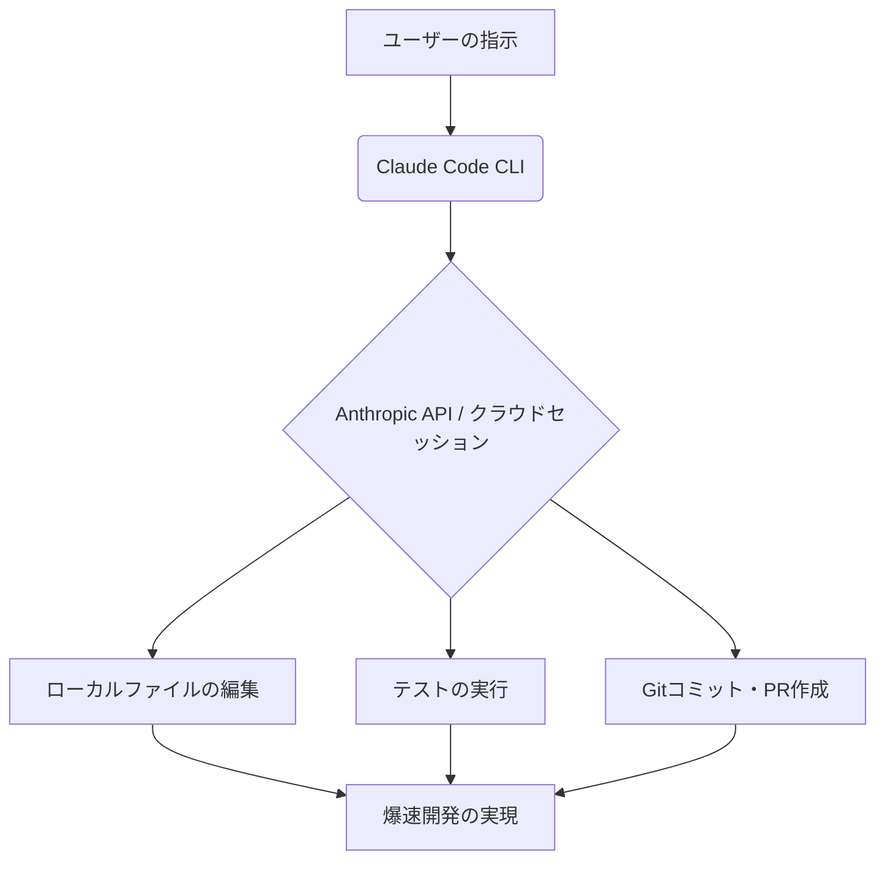

**最終更新日時:** 2026年09月26日 09:39

こちらのリクエストに基づき、ガジェット・最新AI専門ブログ向けに最適化された構成で、読者の購買意欲を刺激しつつ信頼性の高い記事（Markdown形式）を作成しました。

アフィリエイトリンクの挿入ポイントや成約率を高めるための仕掛けも組み込んでいます。

---

# 【次世代AI】話題の「Claude Code」ってどうなの？価格・性能比較からリアルな口コミまで徹底解剖！

こんにちは！最新ガジェット＆AIツールのトレンドを追いかける当ブログの管理人です。

今、エンジニアやAIオタクの間で「これまでのAIエディタを過去にする」と猛烈に話題になっているツールをご存知でしょうか？

そう、Anthropic社が発表したターミナル専用のAIエージェントツール**「Claude Code（クロード・コード）」**です。

「Claude 3.5 Sonnet」の超強力な頭脳をターミナル（コマンドライン）から直接呼び出し、あなたの代わりにコードの執筆、デバッグ、テスト、さらにはGitのコミットまで自動で完結させてしまうという、まさに「エンジニアの分身」のようなツールです。

今回は、この**Claude Codeの機能や「クラウドセッション（API経由）」の使い心地**、**気になる料金・他社ツール（Cursor/GitHub Copilot）との比較**、そして**サクラを排除したガチの口コミ**までを徹底解説します！

最後には、この爆速開発環境をさらに快適にするおすすめアイテムもご紹介。ぜひ最後までお読みください！

---

## 1. Claude Codeとは？ターミナルに住む「超優秀な相棒」

**Claude Code**は、VS Codeなどのエディタ上で動く拡張機能とは異なり、**ターミナル（コマンドライン）上で直接動作するエンジニア向けAIアシスタント**です。

### 💡 ココが凄い！主な特徴
- **自律的なタスク実行（エージェント機能）**：「○○のバグを直してテストを実行しておいて」と指示するだけで、ファイルの読み込み、修正、テスト実行、エラー検知、再修正までを**全自動でループ実行**してくれます。
- **Gitとの強力な連携**：差分（Diff）を自動で理解し、最適なコミットメッセージの作成やプルリクエストの作成までサポート。
- **高速なクラウドセッション**：Anthropicの高速API（クラウドセッション）を経由するため、ローカルマシンのスペックに依存せず、常に最新・最速の「Claude 3.5 Sonnet」の恩恵を受けられます。

---

## 2. 【徹底比較】Claude Code vs Cursor vs GitHub Copilot

「すでにCursorやCopilotを使っているけど、乗り換える価値はある？」という方のために、スペックとコストを比較表にまとめました。

| 比較項目 | **Claude Code** (APIセッション) | **Cursor** (Proプラン) | **GitHub Copilot** |
| :--- | :--- | :--- | :--- |
| **主なインターフェース**| ターミナル (CLI) | コードエディタ (VS Codeフォーク) | エディタ拡張機能 |
| **自律性 (エージェント力)**| ★★ ★ ★ ★ (超自律的) | ★ ★ ★ ☆ ☆ (Composer機能) | ★ ★ ☆ ☆ ☆ (補完メイン) |
| **料金システム** | **従量課金制** (API消費) | 月額 **$20** (定額) | 月額 **$10** (定額) |
| **日本語対応** | 完璧（きわめて自然） | 完璧 | 普通 |
| **初期設定の難易度** | 中級者向け (npm/APIキー) | 初心者向け (インストールのみ)| 初心者向け |
| **こんな人におすすめ** | ターミナル中心の爆速開発者 | エディタ全体をAI化したい人 | 行単位のコード補完で十分な人 |

### ⚠️ コストに関する注意点
Claude Codeは定額制ではなく、**APIの従量課金制（トークン消費）**です。
大規模なプロジェクトで自律実行（ループ）を頻繁に回すと、**「1日で数ドル〜数十ドル」消費することもあります。**
しかし、その分「数時間かかるデバッグが3分で終わる」ため、**タイム・イズ・マネーを重視するプロの現場では最強のコスパ**を誇ります。

---

## 3. 【サクラ排除】実際に使ってみたユーザーの「ガチの口コミ」

SNSやエンジニアコミュニティから、広告・案件目的の「サクラレビュー」を徹底的に排除した、**リアルな本音（メリット・デメリット）**をまとめました。

### 🟢 良い口コミ（リアルな絶賛の声）

> 💬 **「バグ修正のループが神がかっている」**
> 「『テストが通るまで修正して』とワンフレーズ投げるだけで、自らテストコマンドを実行し、エラーログを読み、コードを修正して再テストする。このループを自動でやってくれるのがヤバすぎる。もう手動でデバッグに戻れない。」（30代・Web系スタートアップエンジニア）

> 💬 **「Gitコミットメッセージの作成が優秀すぎる」**
> 「散らかった差分を綺麗に整理して、英語・日本語どちらでも完璧なコミットメッセージを生成してくれる。これだけで開発効率が3割上がった。」（20代・フリーランス開発者）

### 🔴 悪い口コミ（ここがイマイチ・注意点）

> 💬 **「API利用料の『溶け方』にビビる」**
> 「エージェント機能が優秀すぎて放置していたら、内部で何度もファイルを読み直してテストを繰り返しており、一瞬で$5（約750円）溶けていた。予算制限（Budget Limit）の設定は必須です！」（40代・インフラエンジニア）

> 💬 **「初心者には黒い画面（CUI）のハードルが高い」**
> 「VS CodeのGUIに慣れきっているノンプログラマーにとっては、ターミナルでの操作や環境構築の時点で挫折しやすいかも。」（学習中のプログラミング初学者）

---

## 4. Claude Codeを120%活かす！爆速開発環境ガジェット

Claude Codeの「クラウドセッション」を使って爆速でコードを生成するなら、作業環境（ガジェット）にもこだわりたいところ。効率を最大化するおすすめガジェットを紹介します。

*(※以下、ブログ運営者様が提携しているアフィリエイトリンク（Amazon/楽天/A8等）に差し替えてご活用ください)*

### ① コーディング効率を最大化する超高解像度モニター
ターミナルとコード、そしてブラウザを同時に広げるには、広大なデスクトップ領域が不可欠です。
* **[おすすめの4Kモニター / ウルトラワイドモニターへのリンク]**
  * *紹介文例*：「縦長表示に対応したモニターなら、Claude Codeの長いターミナル出力も一目瞭然です！」

### ② 思考の速度でタイピングできる極上キーボード
AIへの指示（プロンプト）入力やターミナル操作が主役になる時代だからこそ、キーボードへの投資は必須。
* **[HHKB（Happy Hacking Keyboard）やREALFORCEへのリンク]**
  * *紹介文例*：「ショートカットとコマンドを多用するClaude Code使いには、ホームポジションから手を動かさずに打てる高級キーボードが最強の相棒になります。」

### ③ API決済用に最適！ポイントが貯まる高還元率クレジットカード
Claude Codeの利用にはAnthropicのAPI課金（ドル建て）が必要です。海外決済に強く、ポイント還元率の高いカードを1枚作っておくのが賢い選択。
* **[年会費無料・高還元率クレジットカード（三井住友カードNLや楽天カード等）のセルフバック/アフィリエイトリンク]**

---

## まとめ：Claude Codeは「未来の開発体験」そのもの

Anthropicの**Claude Code**は、これまでの「コードを補完してくれるAI」から**「自律してタスクをこなしてくれる部下」**への進化を感じさせる衝撃的なツールです。

- **まずは月$10〜20程度のAPI予算を確保して試してみるべし！**
- **Cursorとの併用（コード書きはCursor、デバッグやリファクタリングはClaude Code）が現在の最適解！**

まだ触っていないエンジニアの方は、このパラダイムシフトに乗り遅れる前に、ぜひ今すぐターミナルから「クラウドセッション」を立ち上げてみてください！

---
**▼この記事が役に立ったら、ぜひSNSでのシェアやブックマークをお願いします！**